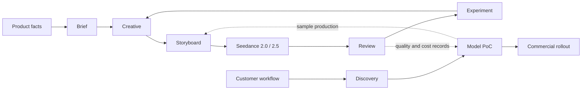

<p align="center">
  <a href="./README.zh-CN.md">简体中文</a> ·
  <a href="./README.md">English</a>
</p>

<div align="center">

# Ad GTM Skills

### From product facts to video ads, and from model pilots to commercial rollout.

[](./LICENSE)
[](https://github.com/AY-kkk/ad-gtm/releases/tag/v0.3.0)
[](./registry/skills.json)
[](./docs/model-support.md)

**Ad GTM is a collection of 11 callable Agent Skills for AI video advertising and video-model commercialization.**

</div>

## What this library does

Ad GTM connects two sides of the same workflow:

- **Brand, agency, and creator teams** turn product information into a defensible brief, creative concepts, storyboards, Seedance production plans, quality checks, and measurable creative experiments.
- **Video-model product, sales, and solutions teams** turn a customer production bottleneck into a scoped discovery, proof of concept, unit-cost comparison, commercial proposal, and rollout plan.

The shared unit is a real, reviewable advertising task. A generated sample is not automatically a passed deliverable; a passed sample is not automatically media performance; and a public model capability is not proof that a customer's account, region, or endpoint is enabled.

## What problem does it solve?

| You have | You need | You get |
| --- | --- | --- |
| Product images, facts, and an audience | A product video ad | Evidence-backed brief, script, storyboard, and production plan |
| An existing ad and a weak opening | Comparable creative variants | Variants with controlled variables and an experiment plan |
| A storyboard and reference assets | Seedance 2.0 or 2.5 production | Version-specific tasks, asset mapping, prompts, and post-production notes |
| A generated clip or final ad | A delivery decision | A scoped review with evidence, timecodes, and rework actions |
| Customer interviews and a current workflow | A model opportunity worth testing | A prioritized use case, baseline, and PoC design |
| A completed pilot | Procurement and scale-up | Commercial scope, responsibilities, milestones, and rollout gates |

## Skill map

Every directory below is a standalone Skill with its own `SKILL.md`, trigger description, inputs, outputs, boundaries, and completion criteria. Install one Skill or a pack; the repository itself is not a single Skill.

| Area | Skill | Use it when | Main output |
| --- | --- | --- | --- |
| Routing | [ad-gtm](skills/ad-gtm/SKILL.md) | You need to choose or connect stages | Task route and handoff |
| Strategy | [ad-brief](skills/ad-brief/SKILL.md) | The audience, claim, or goal is unclear | Brief and evidence table |
| Creative | [ad-creative](skills/ad-creative/SKILL.md) | You need concepts, scripts, or opening variants | Script and test variables |
| Production | [ad-storyboard](skills/ad-storyboard/SKILL.md) | You need a shot plan and asset roles | Timeline and production package |
| Model | [ad-seedance-20](skills/ad-seedance-20/SKILL.md) | The selected production entry is Seedance 2.0 | 2.0 tasks and prompts |
| Model | [ad-seedance-25](skills/ad-seedance-25/SKILL.md) | The selected production entry is Seedance 2.5 | 2.5 continuity and edit tasks |
| Quality | [ad-review](skills/ad-review/SKILL.md) | You need to review a script, clip, or final ad | Evidence-based review and rework list |
| Experiment | [ad-experiment](skills/ad-experiment/SKILL.md) | You need to test or analyze creative variants | Experiment card or result analysis |
| Customer | [ad-discovery](skills/ad-discovery/SKILL.md) | You need to find a customer's bottleneck | Discovery and prioritized use case |
| Pilot | [ad-poc](skills/ad-poc/SKILL.md) | You need to compare a model workflow with a baseline | PoC scorecard and unit cost |
| Commercial | [ad-scale](skills/ad-scale/SKILL.md) | You need to move from pilot to adoption | Commercial and rollout plan |

## Two workflows



For an ad, use `brief → creative → storyboard → selected model → review → experiment`. For commercialization, use `discovery → poc → scale`; connect the PoC to the production path when samples are needed. If you already have a brief, storyboard, or clip, start at that stage.

## Quick start

The Skills are Markdown-based and have no Python runtime dependency. The installer uses Python 3.10+ standard-library features.

```bash
git clone https://github.com/AY-kkk/ad-gtm.git
cd ad-gtm
python3 scripts/skills.py list
python3 scripts/skills.py install --pack all --target ~/.codex/skills
```

Install only what you need:

```bash
python3 scripts/skills.py install --pack seedance25 --target ~/.codex/skills
python3 scripts/skills.py install --skill ad-poc --target ~/.codex/skills
```

Available packs are `all` (11), `creative` (6), `seedance20` (7), `seedance25` (7), and `commercial` (4). The installer refuses to overwrite an existing same-name directory. Add `--replace` to upgrade; it creates a recoverable backup and leaves unrelated Skills untouched. Restart the Agent session after installation.

After installation, start a new task:

```text
Use $ad-gtm to plan a 15-second vertical video ad for this desktop organizer.
The product images and real usage steps are attached. The audience is people
working from home. Use Seedance 2.0. Produce two variants that change only
the opening; keep the body and CTA fixed.
```

For a model pilot:

```text
Use $ad-poc to design a video-model pilot for an e-commerce creative team.
Compare the current workflow with two candidate models using quality, cycle
time, human edit hours, and cost per accepted final ad.
```

## Seedance 2.0 and 2.5

The advertising and GTM logic is shared. The two model Skills separate production constraints and failure handling:

| Skill | Production focus |
| --- | --- |
| `ad-seedance-20` | Short segments, replaceable shots, handoffs, and product-structure checks |
| `ad-seedance-25` | Longer continuity, reference roles, edit scope, and whole-clip review |

Do not select a version from the number alone. Record the provider, service, region, full model ID, mode, capability source, account status, cost basis, and verification date. The current BytePlus LAS reference is recorded in [model support](docs/model-support.md); it does not establish access to another endpoint or account.

## Examples and verification

- [Product ad example](examples/product-ad.md) shows a synthetic organizer-ad brief, two openings, a 15-second storyboard, and a Seedance 2.0 task.
- [Model pilot example](examples/model-pilot.md) shows a synthetic discovery-to-PoC-to-rollout path and a unit-cost calculation.
- [Gaokao volunteer GTM case](examples/gaokao-volunteer-gtm.md) is a user-provided creative production sample. It is marked `not_run` for media performance, model proof, and rights verification.
- [Representative style library](skills/ad-creative/references/style-library.md) turns recognizable advertising mechanics into reusable, rights-aware direction cards.
- [Evaluation cases](evals/cases.json) cover routing, evidence boundaries, model capability claims, review, experiments, and commercialization. They are test prompts, not completed model or media results.

Run structural checks and packaging tests with:

```bash
python3 scripts/skills.py validate
python3 -m unittest discover -s tests -v
python3 scripts/skills.py build --pack all --output dist
```

The repository provides methods, references, templates, and packaging tools. It does not include a video-generation, editing, media-buying, or customer-CRM client. When those tools or permissions are unavailable, the correct output is a production package or pilot plan with execution status `not_run`.

## Repository layout

```text
skills/       11 standalone Skills and their local references/templates
registry/     Skill catalog and install packs
examples/     Product-ad, model-pilot, and product GTM case walkthroughs
docs/         Handoff and model-support notes
evals/        Trigger, boundary, and handoff cases
scripts/      List, validate, install, and build commands
tests/        Packaging, installation, and recovery tests
```

See [contributing](CONTRIBUTING.md) for adding a Skill or model adapter. The Chinese overview is available at [README.zh-CN.md](README.zh-CN.md).

Project history and planned work: [CHANGELOG](CHANGELOG.md) · [ROADMAP](ROADMAP.md).

[MIT License](LICENSE). This project is independent of model providers; provider terms and user-supplied asset rights still apply.
