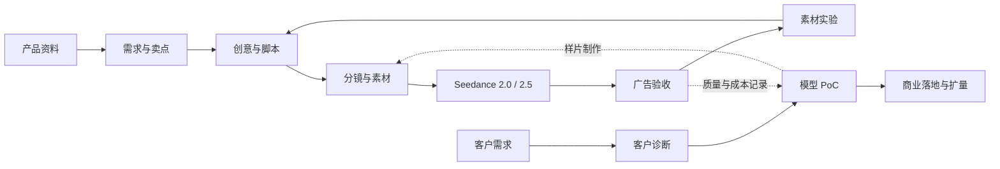

<p align="center">
  <a href="./README.zh-CN.md">简体中文</a> ·
  <a href="./README.md">English</a>
</p>

# Ad GTM Skills

### 从产品资料到视频广告，从客户试点到模型商业化。

**Ad GTM 是一套面向 AI 视频广告的 Agent 技能库，包含 1 个任务导航与 10 个专项 Skill。** 帮助品牌、代理商与创作者完成卖点梳理、创意脚本、分镜、Seedance 制作、验收和素材测试；帮助模型产品、销售与解决方案团队完成客户诊断、PoC、成本评估和商业落地。

[技能地图](#技能地图) · [快速开始](#快速开始) · [广告示例](examples/product-ad.md) · [高考志愿案例](examples/gaokao-volunteer-gtm.md) · [风格库](skills/ad-creative/references/style-library.md)

## 用它解决什么问题

| 你手里有什么 | 想完成什么 | 最后得到什么 |
| --- | --- | --- |
| 产品图、功能资料、目标人群 | 把产品价值讲成一条视频广告 | 有证据的卖点、脚本、分镜与制作包 |
| 已有广告、需要迭代的开头 | 生成能比较的素材变体 | 保持正文一致的变体与测试计划 |
| 分镜与参考素材 | 用 Seedance 2.0 或 2.5 制作 | 分版本提示词、素材映射、任务拆分与后期清单 |
| 生成片段或后期成片 | 判断哪里要返工、是否能交付 | 带依据和时间码的验收报告 |
| 客户访谈、现有制作流程 | 找到值得付费验证的模型场景 | 场景优先级、PoC 设计与成本质量对照 |
| 已完成的试点记录 | 推进采购和规模化使用 | 商业方案、责任分工与扩量计划 |

这里的 GTM（Go-to-Market）同时连接两端：**品牌怎样用视频广告表达和验证产品价值；视频模型团队怎样通过这些真实场景验证并交付商业价值。** 两条路径共用产品事实、制作结果、验收记录与成本口径。

## 技能地图

每个目录都有独立的 `SKILL.md`、触发描述、输入输出和完成标准。可以单独安装，也可以按工作流组合。

| 模块 | Skill | 什么时候使用 | 主要产物 |
| --- | --- | --- | --- |
| 导航 | [ad-gtm](skills/ad-gtm/SKILL.md) | 不知道从哪开始，或需要串起多个阶段 | 任务路径与交付衔接 |
| 策略 | [ad-brief](skills/ad-brief/SKILL.md) | 还没明确向谁讲什么 | 广告 brief、主张证据表 |
| 创意 | [ad-creative](skills/ad-creative/SKILL.md) | 要创意方向、脚本或开头变体 | 脚本、结构与测试变量 |
| 制作 | [ad-storyboard](skills/ad-storyboard/SKILL.md) | 要把创意落实到镜头与素材 | 时间轴、分镜、制作包 |
| 模型 | [ad-seedance-20](skills/ad-seedance-20/SKILL.md) | 使用 Seedance 2.0 制作 | 分段任务、参考映射、提示词 |
| 模型 | [ad-seedance-25](skills/ad-seedance-25/SKILL.md) | 使用 Seedance 2.5 制作 | 连续演示、参考编排、编辑任务 |
| 验收 | [ad-review](skills/ad-review/SKILL.md) | 检查脚本、片段或成片 | 验收结果与返工动作 |
| 实验 | [ad-experiment](skills/ad-experiment/SKILL.md) | 设计素材测试或分析数据 | 对照实验与复盘结论 |
| 客户 | [ad-discovery](skills/ad-discovery/SKILL.md) | 找客户瓶颈与优先场景 | 客户诊断、机会与试点摘要 |
| 试点 | [ad-poc](skills/ad-poc/SKILL.md) | 判断模型是否值得进入生产 | 验收表、质量周期与成本对照 |
| 商业 | [ad-scale](skills/ad-scale/SKILL.md) | 将试点推进到采购和扩量 | 商业范围、接入与扩量计划 |

## 两条工作流



**品牌与代理商：** 从产品资料出发，选创意、做制作包、检查实际成片，再根据实验数据迭代。已有脚本或成片时直接进入对应环节。

**模型商业化团队：** 从客户生产瓶颈出发，选一项有基线、能验收的场景做 PoC，比较质量、周期和合格成片成本，再确定采购和扩量范围。

专项 Skill 可接受用户直接提供的资料，不要求先运行所有上游模块。导航入口按任务选择已安装的模块，不要求后台多 Agent。详见[工作流与交接约定](docs/workflows.md)。

## 快速开始

本库使用 Markdown Skill 格式。安装工具只依赖 Python 3.10+ 标准库；Skill 本身无 Python 运行依赖。

```bash
git clone https://github.com/AY-kkk/ad-gtm.git
cd ad-gtm

# 查看技能与安装组合
python3 scripts/skills.py list

# 安装全部 11 个 Skill 到 Codex 默认技能目录
python3 scripts/skills.py install --pack all --target ~/.codex/skills
```

若设置了 `CODEX_HOME`，将目标改为该目录下的 `skills`。其他支持 `SKILL.md` 的 Agent 使用各自的技能目录。也可直接复制 `skills/` 内需要的完整子目录；**不要把整个仓库当成一个 Skill 安装。**

安装后开启新会话，例如：

```text
用 $ad-gtm 为这款桌面收纳盒规划 15 秒竖屏视频广告。
产品图和操作说明见附件，面向居家办公人群，使用 Seedance 2.0。
先完成创意与制作包，给出两个只改变开头的版本。
```

只需要某个任务时直接调用：

```text
用 $ad-poc 为电商素材团队设计视频模型试点。
已有制作流程和成本表见附件，请比较现有方式与两个候选模型，
约定质量、周期、人工修改量和每条合格成片成本的验收方式。
```

### 按需安装

| 组合 | 包含内容 | 数量 |
| --- | --- | --- |
| `all` | 全部模块 | 11 |
| `creative` | 导航、brief、创意、分镜、验收、实验 | 6 |
| `seedance20` | creative + Seedance 2.0 | 7 |
| `seedance25` | creative + Seedance 2.5 | 7 |
| `commercial` | 导航、客户诊断、PoC、商业落地 | 4 |

```bash
python3 scripts/skills.py install --pack seedance25 --target ~/.codex/skills
python3 scripts/skills.py install --skill ad-poc --target ~/.codex/skills
```

安装器默认拒绝覆盖同名目录。更新或从旧版单 Skill 迁移时，加 `--replace`；被替换目录会完整备份到目标目录旁的 `.ad-gtm-backups/`，无关 Skill 保持原样。

旧版若直接克隆在 `~/.codex/skills/ad-gtm`，请先将新版另行克隆到工作目录，再运行安装器；安装器不会覆盖正在使用的源码仓库。

```bash
git pull --ff-only
python3 scripts/skills.py install --pack all --target ~/.codex/skills --replace
```

[发布页](https://github.com/AY-kkk/ad-gtm/releases)提供可解压安装的分组 ZIP；将压缩包 `skills/` 下的子目录复制到技能目录即可。

## 看一个具体结果

**输入：** 一组收纳盒图片、真实使用步骤、15 秒竖屏要求，核心信息是“分格放置常用物品”。

**交付：**

1. brief：目标人群、可用主张、素材职责与 CTA。
2. 创意：日常寻找物品与整理后桌面两个开头，固定正文。
3. 分镜：0–3 秒开头、3–8 秒操作、8–12 秒结果、12–15 秒收尾。
4. 模型制作包：参考映射、分段提示词、商品禁改项及后期文字。
5. 验收与实验计划：检查结构与操作，比较开头对主要指标的影响。

完整内容见[产品广告示例](examples/product-ad.md)。另有[模型客户 PoC 示例](examples/model-pilot.md)，展示如何从生产瓶颈走到可验收的商业试点；以及[高考志愿填报创意展示案例](examples/gaokao-volunteer-gtm.md)，这是案例提供方提交的真实样片，仅作为创意制作展示。案例页明确标注了未运行的投放效果、模型证明和权利核验范围。

创意阶段可查阅[代表性广告风格库](skills/ad-creative/references/style-library.md)：苹果发布会式极简、重复记忆型广告、Nike 式普通人潜能、Dove 式真实人物、荒诞喜剧、日常功能证明、动作能量、价值与证据、安静产品等。风格库提炼传播机制，不复制广告语、音乐、角色或镜头。

## Seedance 2.0 与 2.5 如何适配

两版使用共用的广告策略、创意、分镜、验收和 GTM 模块；制作时加载对应的独立 Skill。

| 模块 | 制作方法重点 |
| --- | --- |
| `ad-seedance-20` | 短段组织、可替换镜头、片段衔接与商品结构检查 |
| `ad-seedance-25` | 连续演示、参考职责、编辑范围与长段一致性检查 |

这是制作方法的分工，效果与费用通过同任务 PoC 比较。实际限制由服务入口、区域、完整模型 ID 和任务模式决定，见[模型支持说明](docs/model-support.md)。

## 能力与验证范围

本库提供 Agent 可执行的工作方法、参考资料和交付模板。视频生成、剪辑、发布和广告投放由所在环境中的工具与账号完成；没有工具时仍能交付制作包或实验方案。生成画面不能代替产品性能证据，文本审阅也不能代替成片验收。

仓库工具检查技能结构、引用、安装与打包完整性；[行为用例](evals/cases.json)用于人工或 Agent 评测，不计作已完成的模型评测或广告效果验证。运行方式与当前边界见[验证说明](evals/README.md)。

## 仓库结构

```text
skills/       11 个可独立安装的 Skill，参考资料和模板随模块分发
registry/     技能目录、版本与安装组合
examples/     产品广告、客户 PoC 与高考志愿创意案例
docs/         工作流交接与模型支持说明
scripts/      列表、校验、安装与打包工具
evals/        触发、边界和交接评测用例
tests/        安装、打包和完整性测试
```

[MIT License](LICENSE)。本项目独立于模型厂商；模型服务与用户素材适用各自的条款和授权。

[版本记录](CHANGELOG.md) · [后续路线](ROADMAP.md)
